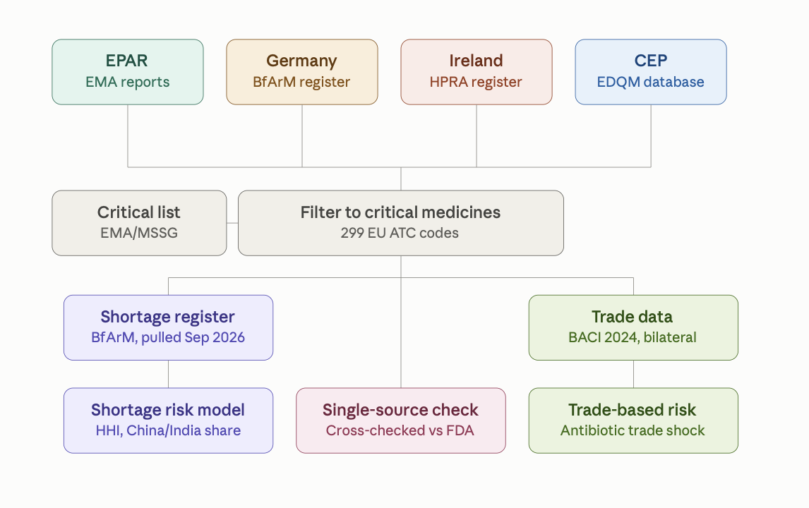

# Medication Supply: Manufacturing Concentration of EU Critical Medicines

This repository contains the data, code and figures for the paper by
E. Dervic, A. Pesce, L. Melnikova and P. Klimek (Supply Chain Intelligence Institute Austria,
Complexity Science Hub, Medical University of Vienna, TU Wien), currently in preparation.

The paper builds the first open dataset that merges manufacturing-site information for the
299 medicines on the EU list of critical medicines from four public sources: the EMA's European
Public Assessment Reports (EPAR), the German BfArM manufacturer register, the Irish HPRA product
register and the EDQM database of Certificates of Suitability (CEP). It uses this dataset to measure
how geographically concentrated the manufacturing of each medicine is, to relate that concentration
to current shortages, to check apparently single-sourced medicines against FDA records, and to
estimate how exposed EU member states are to a halt in Chinese and Indian antibiotic exports.

## Table of Contents

- [Overview](#overview)
- [Repository structure](#repository-structure)
- [Data](#data)
- [Methods and scripts](#methods-and-scripts)
- [Paper figures and tables](#paper-figures-and-tables)
- [How to reproduce](#how-to-reproduce)
- [Independent replication (Python)](#independent-replication-python)
- [Contact](#contact)

## Overview



| Paper section | Status in this repository |
|---|---|
| Manufacturing registers and the Herfindahl-Hirschman Index | complete: data, scripts, figures and Table 1 |
| Data: manufacturing registers (descriptive overview) | complete |
| Shortage risk model (BfArM shortage register, logistic regression) | to be added |
| Single-source medicines and alternative capacity (FDA cross-check) | to be added |
| Trade-based risk comparison (BACI) | to be added |
| Data: critical medicines (treemap) and EU antibiotic consumption (ECDC) | to be added |

## Repository structure

```
data/
├── registers/
│   ├── raw/           the four manufacturer registers and the critical-medicines list (read-only)
│   └── processed/     combined, standardised register table written by the scripts
└── replication/       inputs of the independent Python replication (see below)
    ├── raw/
    └── interim/
scripts/
├── run_all.R          runs every register script in order
├── registers/         R analysis behind the register results of the paper
│   ├── paths.R
│   ├── 01_combine_sources.R … 08_api_diversification.R
└── replication/       Python replication pipeline
figures/               figures used in the paper, file names as in the manuscript
└── additional/        per-source variants of the paper figures, not in the paper
results/
├── tables/            HHI per ATC code and source, Table 1 (.csv and .tex)
└── replication/       tables and figures of the Python replication
```

## Data

### Critical medicines

`data/registers/raw/critical.csv` lists the 299 ATC level-5 codes of the Union list of critical
medicines published by the EMA and the Medicine Shortages Steering Group (MSSG). Every analysis is
restricted to these codes and is carried out per ATC level-5 code, not per branded product.

### Manufacturer registers

| File in `data/registers/raw/` | Source | Collected | Content |
|---|---|---|---|
| `EMA_data_critical.csv` | EMA EPAR product information, Annex II | May 2026 | one row per medicine × manufacturing site, with country and manufacturing step (1 = active substance, 2 = finished product / batch release); already restricted to critical ATC codes |
| `bfarm_api_origin_critical_rest_LONG.csv` | German BfArM manufacturer register | 2026 | one row per product × role × company; role is *Zulassungsinhaber* (marketing-authorisation holder), *Wirkstoffherstellung* (active-substance manufacture) or *Hersteller/Endfreigabe* (manufacture / batch release); country names in German; already restricted to critical ATC codes |
| `ireland_critical_atc_review.csv` | Irish HPRA product register | 2026 | one row per product with "\|"-separated lists of manufacturers and their countries; no manufacturing-step field; already restricted to critical ATC codes |
| `EXPORT_WEB_CEP.txt` | EDQM CEP certification database export | August 2026 | all certificates: substance, holder (name, city and ISO-2 country code in one field), status |
| `EXPORT_WEB_CEP_with_ATC_drugbank.csv` | `EXPORT_WEB_CEP.txt` with ATC codes attached via DrugBank | August 2026 | as above plus an `atc_code` column (comma-separated when several apply) |

All four registers were obtained from the publicly available online sources. Records were checked
manually and some rows were corrected by hand, so re-collecting the registers today will not give a
byte-identical result; the analysis in the paper uses the files in this folder.

After restriction to critical medicines the four sources cover:

| Source | ATC codes | Manufacturers | Countries |
|---|---|---|---|
| Germany (BfArM) | 251 | 1,824 | 48 |
| Ireland (HPRA) | 205 | 523 | 32 |
| CEP (EDQM) | 79 | 313 | 29 |
| EPAR (EMA) | 51 | 140 | 26 |

Together they cover 291 of the 299 critical ATC codes.

### Data not included in the repository

| Data | Why | How to obtain |
|---|---|---|
| DrugBank full database (`DrugBank_FullDatabase.xml`, 795 MB) | licence does not permit redistribution; size | Create a free academic account at <https://go.drugbank.com/releases/latest> and download "All drugs" (XML). It is only needed to rebuild `EXPORT_WEB_CEP_with_ATC_drugbank.csv`; no script in this repository reads it. Place it in `data/registers/raw/` (git-ignored). |
| CEPII BACI bilateral trade data, 2024 | size | Download BACI from <https://www.cepii.fr/CEPII/en/bdd_modele/bdd_modele_item.asp?id=37> and keep the year-2024 file. The trade analysis uses HS-6 codes 294110, 294130, 294150 and 294190. Instructions for where to place it will be added with the trade scripts. |

## Methods and scripts

All register scripts live in `scripts/registers/` and are run from the repository root. Input and
output folders are set once in `paths.R`.

### Harmonising the four sources — `01_combine_sources.R`

Writes `data/registers/processed/manufacturer_registers_combined.csv`: one row per ATC code ×
manufacturer × country × manufacturing step × source, with the ATC level-1 chapter attached.

- **EPAR.** Manufacturer name, country and step are used as published. Rows whose "manufacturer"
  has no country are fragments of the PDF text (e.g. "B. CONDITIONS") and are dropped.
- **Germany.** Marketing-authorisation holders are not manufacturers and are dropped.
  *Wirkstoffherstellung* becomes step 1 and *Hersteller/Endfreigabe* step 2. German country names are
  translated to English, and both "Vereinigtes Königreich" variants map to United Kingdom.
- **Ireland.** The clean `matched_critical_atc` column is used, not the free-text `atc_code`; one row
  with two codes in that column is split. The parallel "|"-separated manufacturer and country lists are
  paired up element by element. Where the two lists differ in length, the row is kept unsplit rather
  than guessing a pairing. Trailing full stops in country names are removed.
- **CEP.** The export is not pre-filtered, so cells holding several ATC codes are split first and the
  result is then restricted to the critical codes. The holder's country is the trailing ISO-2 code of
  the holder field.
- In all sources whitespace in names is collapsed, so names that differ only by an embedded line break
  count as one manufacturer.
- If `critical.csv` is missing, the scripts fall back to the union of ATC codes in the EPAR,
  German and Irish files, which are already restricted to critical medicines.

### Site identity and manufacturing step

A manufacturing site is identified by the BfArM site number (`pu_nummer`) for Germany, by
manufacturer name for EPAR and Ireland, and by certificate holder for CEP.

EPAR and Germany distinguish active-substance manufacture (step 1) from finished-product manufacture
and batch release (step 2). For the concentration measures (HHI, API diversification) a
**step-1 priority** rule applies: for each ATC code, step-1 records are used whenever at least one
exists, and step-2 records only for codes with no step-1 disclosure at all. Ireland has no step field
and all its manufacturers are used, which likely overstates concentration relative to an API-only
view. CEP certificates identify the active-substance manufacturer directly, so no step distinction
applies.

### Country-level concentration — `03_hhi.R`

For each ATC code and source the Herfindahl-Hirschman Index is

$$\mathrm{HHI} = 10\,000 \sum_{i=1}^{n} s_i^2,$$

where $s_i$ is the share of the code's manufacturing sites located in country $i$. HHI is 10,000 when
all sites are in one country. The dashed lines in the figures mark 1,500 and 2,500, the conventional
thresholds for moderate and high concentration.

Writes `results/tables/hhi_step1_priority.csv` (one row per ATC code and source: number of
countries and sites, HHI, effective number of countries $10\,000/\mathrm{HHI}$). It also writes
`results/tables/hhi_highest_by_source.csv` and `.tex` (Table 1): for each source, how often it
reports the highest HHI among all sources covering that code. Ties count for every tied source.

### Descriptive and geographic figures

| Script | What it computes |
|---|---|
| `02_plots_by_source.R` | totals of ATC codes, manufacturers and countries per source; manufacturers and countries per ATC code; top 10 manufacturing countries |
| `04_atc_summary.R` | number of distinct manufacturers against number of distinct countries per ATC code (hexagonal bins), per source |
| `05_bubble_matrix.R` | unique sites (dot size) and unique critical ATC codes (colour) per country × ATC chapter; non-EU/EEA countries in bold |
| `06_eea_by_step.R` | share of unique sites per ATC chapter that are EEA step 1, EEA step 2 or non-EEA. No step-2 records are dropped here: a site counts as step 1 if it has any step-1 record |
| `07_country_groups.R` | the same shares split into China / India / EU-EEA / Other, darker shade for step 1 |
| `08_api_diversification.R` | per substance, distinct API sites against share of those sites in China or India, step-1 priority. Substances with at most 30 sites and more than 65 % China+India share are labelled. For Ireland the product name stands in for the substance, since the register has no substance field |

## Paper figures and tables

| In the paper | File | Script |
|---|---|---|
| Fig. `fig:atc_summary_report` — manufacturers vs. countries per ATC code | `figures/atc_summary_report_plot_v2.png` | `04_atc_summary.R` |
| Fig. `fig:bubble_matrix_by_source` — country × ATC chapter footprint | `figures/bubble_matrix_by_source.png` | `05_bubble_matrix.R` |
| Fig. `fig:manufacturing_sites_by_chapter_step_source` — EEA / non-EEA by step | `figures/manufacturing_sites_by_chapter_step_source.png` | `06_eea_by_step.R` |
| Fig. `fig:manufacturing_sites_by_chapter_country_group_source` — China / India / EU-EEA / Other | `figures/manufacturing_sites_by_chapter_country_group_source.png` | `07_country_groups.R` |
| Fig. `fig:api_diversification_germany` — API diversification, Germany | `figures/api_diversification_Germany.png` | `08_api_diversification.R` |
| Fig. `fig:hhi_step1_priority_by_source` — HHI distribution per source | `figures/hhi_step1_priority_by_source.png` | `03_hhi.R` |
| Fig. `fig:hhi_by_chapter_by_source` — HHI by ATC chapter | `figures/hhi_by_chapter_by_source.png` | `03_hhi.R` |
| Table `tab:hhi_highest_by_sourceT` — source with the highest HHI | `results/tables/hhi_highest_by_source.tex` | `03_hhi.R` |
| Fig. `fig:plots_by_source` — descriptive overview per source | `figures/plots_by_source.png` | `02_plots_by_source.R` |
| Shortage model, FDA cross-check, trade figures, treemap, consumption trend | — | to be added |

The single-source variants (`bubble_matrix_<source>.png`, `hhi_by_chapter_<source>.png`,
`api_diversification_<source>.png`) and the earlier two-panel `atc_summary_report_plot.png` are in
`figures/additional/`.

## How to reproduce

Requirements: R ≥ 4.3 and, for the replication only, Python ≥ 3.11. The results in this repository
were produced with R 4.6.0 and Python 3.14.

```r
install.packages(c("readr", "dplyr", "tidyr", "ggplot2", "janitor", "stringr", "purrr",
                   "patchwork", "tidytext", "forcats", "scales", "ggrepel", "xtable", "hexbin"))
```

From the repository root:

```bash
Rscript scripts/run_all.R
```

This runs `scripts/registers/01_…` to `08_…` in order (about 15 seconds) and rewrites
`data/registers/processed/`, `figures/` and `results/tables/`. Only `02` and `05` depend on the
output of `01`; every other script reads the raw registers directly, so a single figure can be
rebuilt with, for example, `Rscript -e 'source("scripts/registers/03_hhi.R", encoding = "UTF-8")'`.

**Locale.** The country-name maps contain non-ASCII names ("Vereinigtes Königreich"). In a non-UTF-8
locale, R reads these names in the scripts differently from the names in the data. The 1,276 German
rows for the United Kingdom then lose their country and the HHI of a few codes changes. `run_all.R`
therefore switches to a UTF-8 locale and stops if none is available. Run single scripts from RStudio
or a UTF-8 terminal.

## Independent replication (Python)

`scripts/replication/` is a second, independently written pipeline. It is not used for any number in
the paper. It rebuilds substance-level supply from the current public downloads (EDQM CEP export, EMA
EPAR manufacturers, HPRA XML, EMA medicine and shortage reports, Union list of critical medicines) and
computes the same country-level concentration measures. It shows that the register results do not hinge
on the hand-curated files above.

| Source | Codes (registers) | Codes (replication) | Codes in both | Spearman ρ, HHI | Spearman ρ, number of countries | Same number of countries | Single-country share (registers / replication) |
|---|---|---|---|---|---|---|---|
| CEP | 79 | 169 | 79 | 0.93 | 0.95 | 89 % | 5 % / 5 % |
| EPAR | 51 | 100 | 50 | 0.81 | 0.84 | 64 % | 42 % / 34 % |

The replication covers more codes because it maps substance names to ATC codes through several
sources rather than DrugBank alone. It does not include the German register. HPRA publishes no
manufacturer country, so the Irish layer cannot enter country measures.

### Setup and run

```bash
python -m venv venv && source venv/bin/activate
pip install -r requirements.txt
```

```bash
python scripts/replication/01-data-prep/fetch.py
```

Downloads the automatically fetchable sources into `data/replication/raw/` and records URL, time and
SHA-256 of each in `manifest.json`. The committed snapshot was fetched on 20 September 2026. Running
`fetch.py` again replaces it with today's versions. Two files have to be downloaded by hand,
as described in `common/config.py`: `edqm_cep.txt` (EDQM, 23 August 2026) and `bfarm_shortages.csv`
(BfArM, all reports, 23 August 2026). `manufacturers.csv` comes from an earlier project that scraped
the EPAR Annex II manufacturer blocks and geocoded the addresses.

```bash
python scripts/replication/01-data-prep/inspect_sources.py > results/replication/schema_report.txt
python scripts/replication/01-data-prep/build_supply.py
python scripts/replication/02-analysis/analyse.py
python scripts/replication/03-figures/plots.py
python scripts/replication/02-analysis/qc.py
python scripts/replication/04-comparison/compare_with_registers.py
```

| Step | Output |
|---|---|
| `build_supply.py` | `data/replication/interim/supply_long.csv`: one row per substance × supplier × country × role (`api_cep`, `bio_api`, `batch_release`, `mah_national`) |
| `analyse.py` | `results/replication/`: `summary.txt`, `substance_supply.csv`, `country_totals.csv`, `distribution.csv`, `sensitivity.csv`, `atc_supply.csv`, `atc_chapter_totals.csv` |
| `plots.py` | `results/replication/figures/`: counterparts of the register figures, with role in place of source |
| `qc.py` | PASS / WARN / FAIL checks on country resolution, ATC coverage and format, duplicates, normalisation and Union-list coverage; exits non-zero on failure |
| `compare_with_registers.py` | `results/replication/comparison_with_registers.csv`: the table above |

### Design decisions

- **ATC codes.** Only EPAR and HPRA publish ATC codes. CEP rows get theirs from a substance → ATC
  map assembled from the Union list, the EPAR manufacturers file, the EMA medicines report and the
  register CEP file. Rows are not exploded per code, and codes are kept at the level the source
  published them. Coverage is 76.6 % of rows: 99 % for EPAR and HPRA, 32 % for CEP. The CEP figure is
  the ceiling of matching against Ph. Eur. monograph titles.
- **HPRA has no country.** The XML has no address field, and resolving bare company names is wrong:
  legal-form suffixes read as ISO codes (`Teva SA` → Saudi Arabia). `country_iso2` is therefore left
  empty for the `mah_national` role. That role is excluded from every country measure via
  `COUNTRY_ROLES` in `config.py`, but still counts towards substance and ATC coverage.
- **HPRA XML parsing.** Repeated fields sit in container elements (`<ActiveSubstances>`), which
  `pandas.read_xml` does not flatten. `build_hpra` walks the children directly.
- **API diversification** is restricted to Union-list substances. Without that filter, CEP substance
  strings carrying process descriptions ("Acetazolamide, process B") produce spurious single-supplier
  substances.

## Contact

- Elma Dervic, Complexity Science Hub Vienna / ASCII
- Liubov Melnikova, TU Wien
